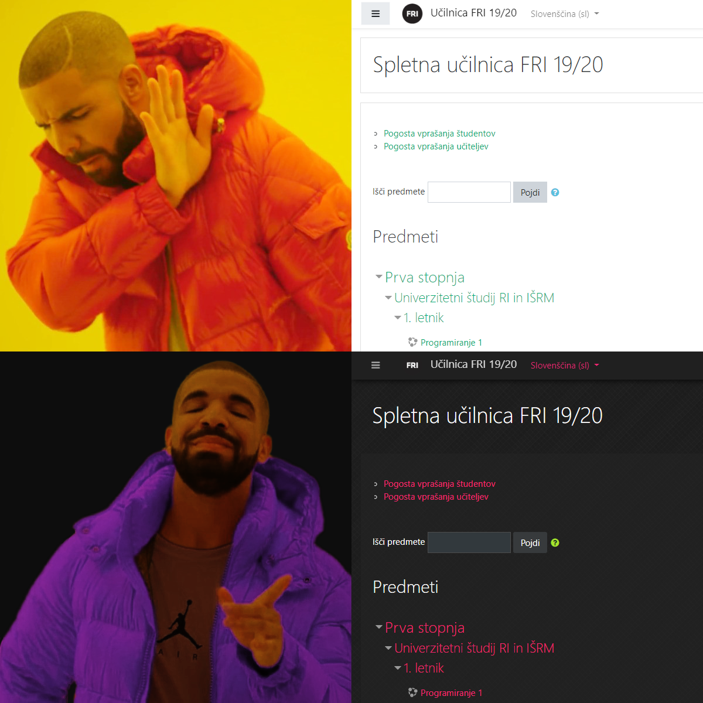

# Fri dark theme
A dark theme for the FRI moodle online classroom.

##  :gear: Installation

Install [Stylus](https://add0n.com/stylus.html) for either [Firefox](https://addons.mozilla.org/en-US/firefox/addon/styl-us/), [Chrome](https://chrome.google.com/webstore/detail/stylus-beta/apmmpaebfobifelkijhaljbmpcgbjbdo) or [Opera](https://addons.opera.com/en-gb/extensions/details/stylus/) or [Cascadea for Safari](https://cascadea.app/) ...

and then: 

[Install the usercss](https://raw.githubusercontent.com/janvasiljevic/fri-dark-theme/master/fri-dark.user.css)
)

